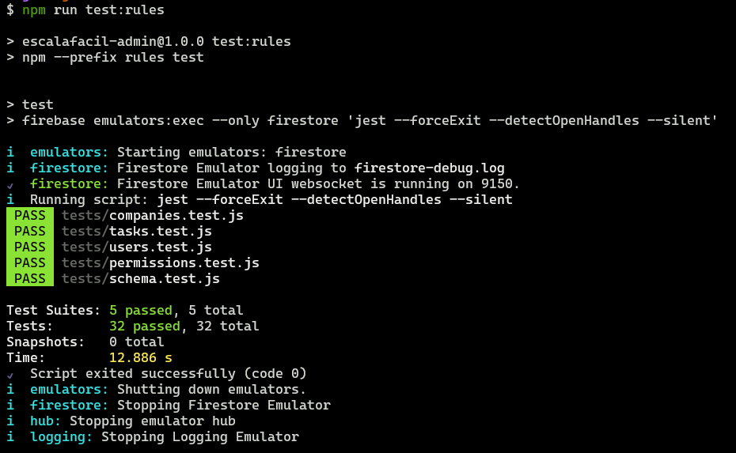
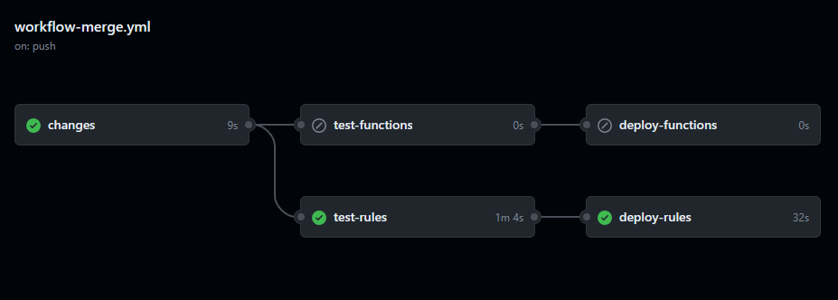

[](https://github.com/EscalaFacil/admin/actions/workflows/workflow-merge.yml)


## About
This repository contains the Firebase Functions and Firestore Rules for the Escala Fácil project.


## Requirements
- [Firebase CLI](https://firebase.google.com/docs/cli)
- [Java 8 or above](https://www.java.com/)
- [Node.js 18 or above](https://nodejs.org/)


## Docs
- [Firebase Functions](https://firebase.google.com/docs/functions/)
- [Firestore Rules](https://firebase.google.com/docs/rules)


## Authentication
Authenticate with Firebase using your Google account by running the following command:
```bash
firebase login
```


## Installing Dependencies
Run the following command:
```bash
npm install
``` 


# Firebase Functions
You can create or edit the project functions in the `functions/src` folder.

## Testing
Run the following command:
```bash
npm run test:functions
```

## Deploy
The deployment is done automatically by GitHub Actions when a new commit is pushed to the `main` branch.

## Deploying Manually
It's not advised to deploy manually, but if you need to, run the following command:
```bash
npm run deploy:functions
```


# Firestore Rules
You can edit the project rules in the `rules/firestore.rules` file.

## Testing
Run the following command:
```bash
npm run test:rules
```


## Deploy
The deployment is done automatically by GitHub Actions when a new commit is pushed to the `main` branch.


## Deploying Manually
It's not advised to deploy manually, but if you need to, run the following command:
```bash
npm run deploy:rules
```